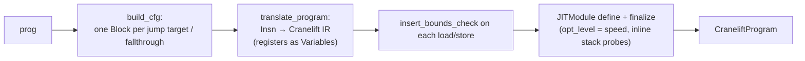

# Cranelift JIT

**Relevant source files**

- [src/cranelift.rs](https://github.com/volnlabs/rbpf/blob/main/src/cranelift.rs)
- [src/lib.rs](https://github.com/volnlabs/rbpf/blob/main/src/lib.rs)
- [tests/cranelift.rs](https://github.com/volnlabs/rbpf/blob/main/tests/cranelift.rs)
- [Cargo.toml](https://github.com/volnlabs/rbpf/blob/main/Cargo.toml)

The `cranelift` feature adds a second JIT, built on the Cranelift code generator (crates `cranelift-codegen`, `-frontend`, `-jit`, `-native` and `-module`, version 0.127). It targets whatever host `cranelift_native::builder()` supports. Unlike the handwritten backend, it inserts bounds checks on memory accesses.

## API

Every VM wrapper gets two methods when `feature = "cranelift"`:

```rust
pub fn cranelift_compile(&mut self) -> Result<(), Error>;

// EbpfVmMbuff
pub fn execute_program_cranelift(&self, mem: &mut [u8], mbuff: &'a mut [u8]) -> Result<u64, Error>;
// EbpfVmFixedMbuff
pub fn execute_program_cranelift(&mut self, mem: &'a mut [u8]) -> Result<u64, Error>;
// EbpfVmRaw
pub fn execute_program_cranelift(&self, mem: &'a mut [u8]) -> Result<u64, Error>;
// EbpfVmNoData
pub fn execute_program_cranelift(&self) -> Result<u64, Error>;
```

`cranelift_compile` clones the VM's helper map into a `CraneliftCompiler`. That compiler registers each helper as a JIT symbol named `helper_<id>`, translates the program into a single function, and stores the resulting `CraneliftProgram` in the VM. Unlike `execute_program_jit`, `execute_program_cranelift` is **not** marked `unsafe`.

## Internal ABI

```rust
pub type JittedFunction = extern "C" fn(
    *mut u8, // mem_ptr
    usize,   // mem_len
    *mut u8, // mbuff_ptr
    usize,   // mbuff_len
) -> u64;
```

The function prelude sets up:

- a 512-byte (`STACK_SIZE`) explicit stack slot, with `r10` at its end,
- `r1` = `mbuff_ptr` if `mbuff_len != 0`, otherwise `mem_ptr`,
- `r2` = the matching length. The comment in `build_function_prelude` notes the conformance tests expect this; for that reason the Cranelift conformance run does not exclude the `mem-len` tests,
- variables holding the start and end of stack, `mem` and `mbuff`, for bounds checks.

## Translation



Behaviour notes:

- **Bounds checks**: every load and store checks that `[addr, addr+size)` does not overflow and fits inside the stack, `mem` (if non-null) or `mbuff` (if non-null). A failed check executes `trapz(..., TrapCode::HEAP_OUT_OF_BOUNDS)`, which is a hardware trap, not a Rust `Err`. Ranges added with `register_allowed_memory` are **not** consulted.
- **Calls**: `CALL` is always lowered as a helper call through the imported `helper_<imm>` symbol. An unregistered ID fails compilation with "[CRANELIFT] Error: unknown helper function". eBPF-to-eBPF local calls are not translated.
- **Division by zero**: division gives 0, and modulo leaves `dst` unchanged (implemented with `select`, not a trap).
- **Unsupported**: `TAIL_CALL` and any opcode without a translation hit `unimplemented!()`.
- **Memory release**: dropping `CraneliftProgram` calls `JITModule::free_memory`.

## Tests

`tests/cranelift.rs` is compiled only with `#![cfg(feature = "cranelift")]` and holds 24 tests. CI also runs the `bpf_conformance` suite through `rbpf_plugin --cranelift`, excluding only the `lock` (atomics) tests. That step is blocking.
