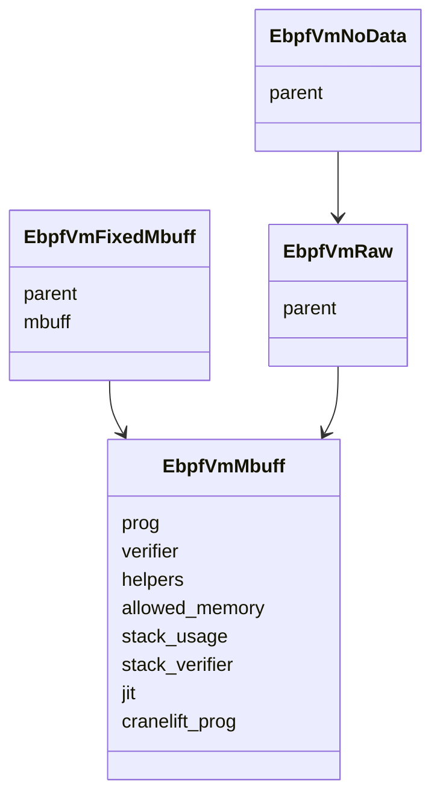
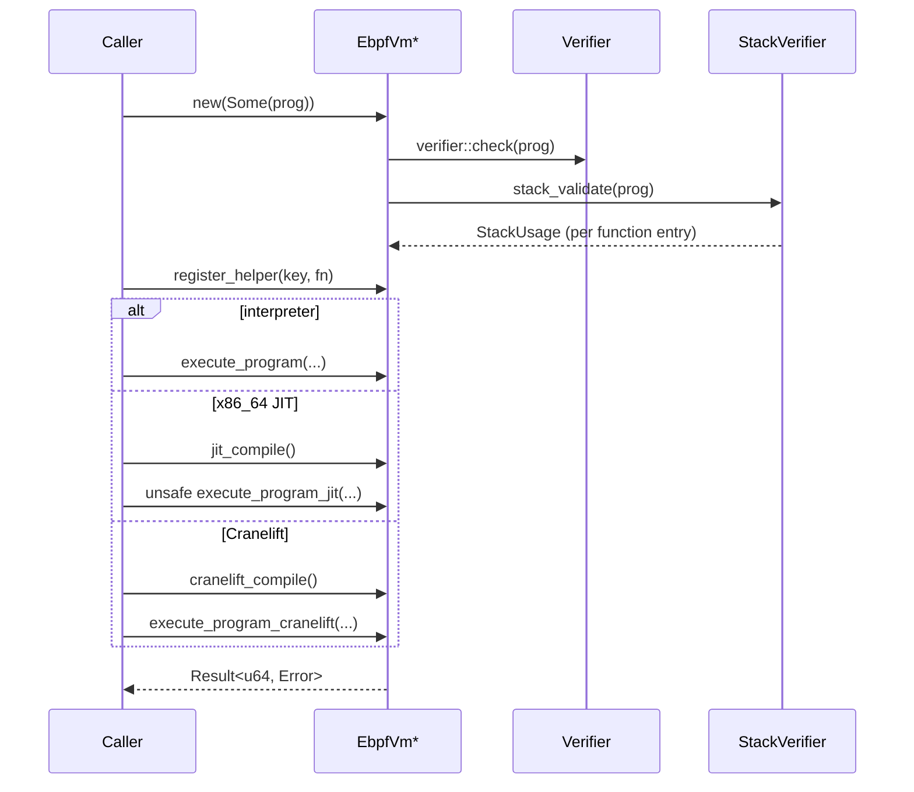
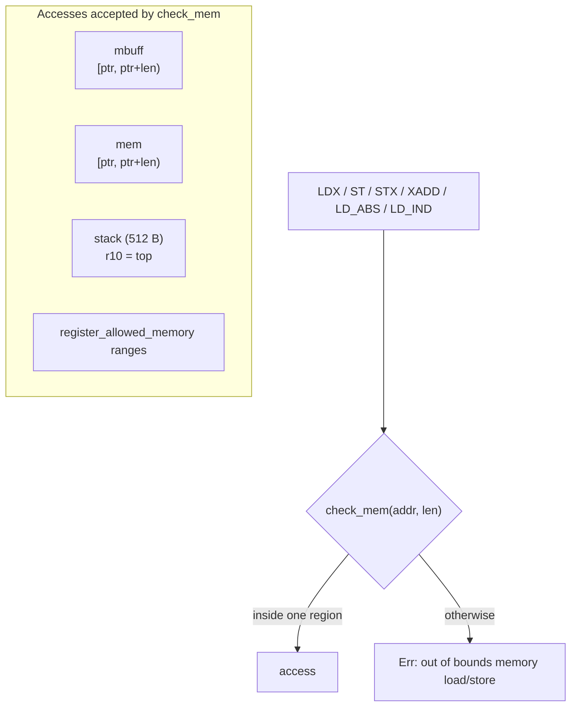

import { Callout } from 'nextra/components'

# VM wrappers and memory model

**Relevant source files**

- [src/lib.rs](https://github.com/volnlabs/rbpf/blob/main/src/lib.rs)
- [src/interpreter.rs](https://github.com/volnlabs/rbpf/blob/main/src/interpreter.rs)
- [src/stack.rs](https://github.com/volnlabs/rbpf/blob/main/src/stack.rs)
- [tests/misc.rs](https://github.com/volnlabs/rbpf/blob/main/tests/misc.rs)

eBPF was designed for packet filtering. In the Linux kernel a program first receives a metadata buffer (`struct __sk_buff`), reads the packet's start and end pointers from it, and only then touches packet data. rbpf can reproduce that layout, but does not require it. It offers four VM wrapper structs. They differ only in what the program gets in `r1` and which buffers the interpreter treats as valid memory.

## The four wrappers



| Struct | `r1` at entry | Execution inputs | Typical use |
|---|---|---|---|
| `EbpfVmMbuff` | address of the caller's metadata buffer | `mem`, `mbuff` | Kernel-style programs where the caller builds the metadata buffer |
| `EbpfVmFixedMbuff` | address of an internal metadata buffer | `mem` | Kernel-style programs; the VM writes `mem` start/end pointers at fixed offsets before each run |
| `EbpfVmRaw` | address of `mem` (uBPF behaviour) | `mem` | Programs that read packet data directly |
| `EbpfVmNoData` | 0 | none | Deterministic programs, unit tests |

All wrappers borrow the program for lifetime `'a`. They do not copy it.

## Common API

Every wrapper exposes the same surface. Signatures below are for `EbpfVmMbuff`. The others drop the `mbuff` and/or `mem` arguments.

```rust
pub type Verifier = fn(prog: &[u8]) -> Result<(), Error>;
pub type Helper = fn(u64, u64, u64, u64, u64) -> u64;
pub type StackUsageCalculator = fn(prog: &[u8], pc: usize, data: &mut dyn Any) -> u16;

impl<'a> EbpfVmMbuff<'a> {
    pub fn new(prog: Option<&'a [u8]>) -> Result<EbpfVmMbuff<'a>, Error>;
    pub fn set_program(&mut self, prog: &'a [u8]) -> Result<(), Error>;
    pub fn set_verifier(&mut self, verifier: Verifier) -> Result<(), Error>;
    pub fn set_stack_usage_calculator(
        &mut self,
        calculator: StackUsageCalculator,
        data: Box<dyn Any>,
    ) -> Result<(), Error>;
    pub fn register_helper(&mut self, key: u32, function: Helper) -> Result<(), Error>;
    pub fn register_allowed_memory(&mut self, addrs_range: Range<u64>);
    pub fn execute_program(&self, mem: &[u8], mbuff: &[u8]) -> Result<u64, Error>;

    // all(target_arch = "x86_64", not(windows))
    pub fn jit_compile(&mut self) -> Result<(), Error>;
    pub unsafe fn execute_program_jit(&self, mem: &mut [u8], mbuff: &'a mut [u8])
        -> Result<u64, Error>;
    // additionally not(feature = "std")
    pub fn set_jit_exec_memory(&mut self, memory: &'a mut [u8]) -> Result<(), Error>;

    // feature = "cranelift"
    pub fn cranelift_compile(&mut self) -> Result<(), Error>;
    pub fn execute_program_cranelift(&self, mem: &mut [u8], mbuff: &'a mut [u8])
        -> Result<u64, Error>;
}
```

Per-wrapper differences:

| Wrapper | Constructor | `set_program` | `execute_program` |
|---|---|---|---|
| `EbpfVmMbuff` | `new(prog)` | `(prog)` | `(&self, mem: &[u8], mbuff: &[u8])` |
| `EbpfVmFixedMbuff` | `new(prog, data_offset, data_end_offset)` | `(prog, data_offset, data_end_offset)` | `(&mut self, mem: &'a mut [u8])` |
| `EbpfVmRaw` | `new(prog)` | `(prog)` | `(&self, mem: &'a mut [u8])` |
| `EbpfVmNoData` | `new(prog)` | `(prog)` | `(&self)` |

`EbpfVmFixedMbuff` takes `&mut self` for execution because it rewrites its internal buffer on every call.

## Program lifecycle



- `new(None)` creates a VM with no program. Executing or compiling it returns an error ("No program set").
- `set_program` runs the VM's current verifier (`new` always uses the default `verifier::check`) and then recomputes stack usage.
- `set_verifier` runs the new verifier against the loaded program right away, if there is one, and only installs it if that check passes.
- `set_stack_usage_calculator` recomputes stack usage for the loaded program right away.

<Callout type="warning">
JIT state is **not** cleared by `set_program` or `register_helper`. After you replace the program or add a helper, call `jit_compile()` / `cranelift_compile()` again. Helpers that compiled code calls must be registered **before** compiling: the x86 JIT embeds their addresses, and Cranelift binds them as symbols.
</Callout>

### `EbpfVmFixedMbuff` metadata buffer

The constructor allocates an internal buffer of `max(data_offset, data_end_offset) + 8` bytes. Before each run, `execute_program` writes `mem.as_ptr()` at `data_offset` and `mem.as_ptr() + mem.len()` at `data_end_offset` (little-endian `u64`). The JIT variant passes both offsets to the generated code, which writes the same pointers itself.

In the fork, `set_program(prog, data_offset, data_end_offset)` verifies `prog` **before** it replaces the buffer and offsets. Previously, a rejected program could leave the old bytecode paired with the new metadata layout. `tests/misc.rs` covers this regression.

## Memory model (interpreter)

The interpreter allocates a fresh, zeroed `STACK_SIZE` (512-byte) stack on every call. `r10` points to its top.



Each load or store computes `addr = reg + off` (with wrapping) and checks that `[addr, addr+len)` lies entirely inside `mbuff`, `mem`, or the stack. For `register_allowed_memory` ranges the check is different: it only tests whether the **start** address is contained in a registered range.

`register_allowed_memory(range)` adds a `Range<u64>` to a `HashSet`. Use it for pointers that helpers return, such as map values (see `examples/allowed_memory.rs`). Only the interpreter enforces these ranges. The x86 JIT performs no checks. The Cranelift JIT checks stack, `mem` and `mbuff` only.

### eBPF-to-eBPF calls and stack frames

The interpreter supports local calls (`CALL` with `src = 1`). On each call it:

1. saves `r6`–`r9` and the return address in a `StackFrame`,
2. lowers `r10` by the caller's stack usage (`LOCAL_FUNCTION_STACK_SIZE` = 256 bytes by default, or the value from a custom `StackUsageCalculator`),
3. jumps to `pc + 1 + imm`.

`EXIT` inside a callee restores the saved state. Nesting is limited to `MAX_CALL_DEPTH` (8). The stack is not checked when a call is made: if the callee overruns the 512-byte region, its stack accesses fail `check_mem`. See [Verifier and stack usage](/rbpf/verifier).

## Engine comparison

| | Interpreter | x86_64 JIT | Cranelift JIT | AArch64 compiler |
|---|---|---|---|---|
| Entry point | `execute_program` | `jit_compile` + `execute_program_jit` | `cranelift_compile` + `execute_program_cranelift` | `aarch64::Aarch64Compiler` (separate API) |
| Memory checks | yes (`check_mem`, allowed ranges) | none | stack/mem/mbuff, traps on failure | delegated to embedder callbacks |
| Local calls | yes | yes | no (CALL lowered as helper call) | rejected |
| Tail calls | error | `unimplemented!()` | `unimplemented!()` | rejected |
| Division by zero | DIV gives 0; MOD64 leaves dst; MOD32 keeps low 32 bits, clears upper | DIV gives 0; MOD leaves dst | DIV gives 0; MOD leaves dst | traps with `STATUS_DIVISION_BY_ZERO` |
| `no_std` | yes | with `set_jit_exec_memory` | not targeted (uses host `cranelift-jit` module) | yes, including `aarch64-unknown-none` |

Each engine is covered on its own page: [Interpreter](/rbpf/vms/interpreter), [x86_64 JIT](/rbpf/vms/x86-64-jit), [Cranelift JIT](/rbpf/vms/cranelift), [AArch64 JIT](/rbpf/aarch64-jit).
