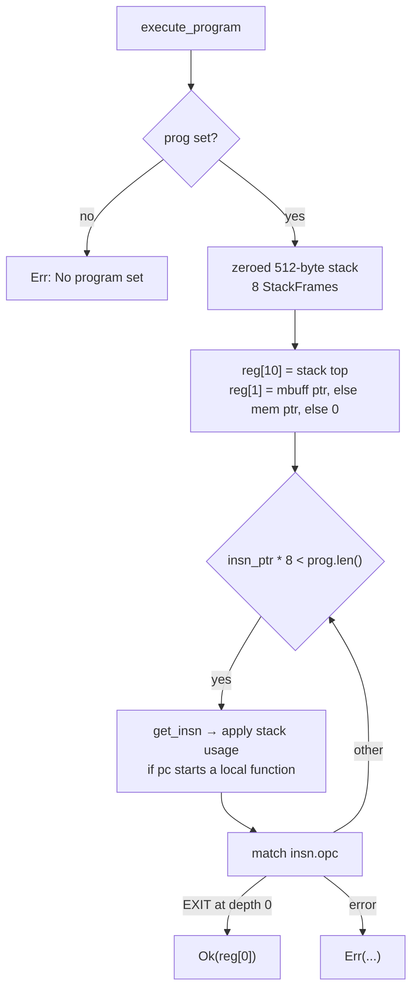
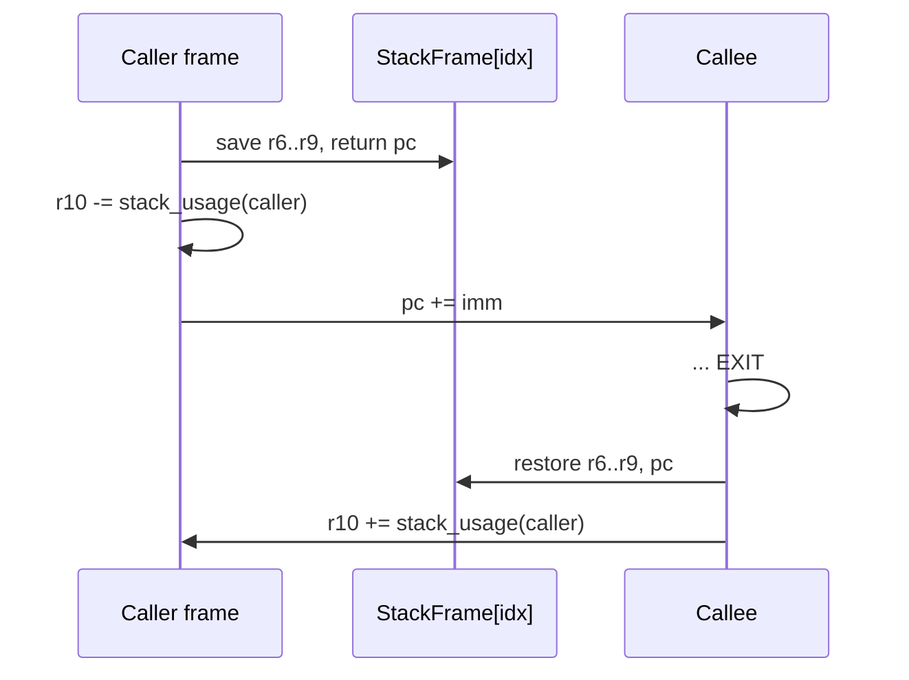

import { Callout } from 'nextra/components'

# Interpreter

**Relevant source files**

- [src/interpreter.rs](https://github.com/volnlabs/rbpf/blob/main/src/interpreter.rs)
- [src/stack.rs](https://github.com/volnlabs/rbpf/blob/main/src/stack.rs)
- [src/ebpf.rs](https://github.com/volnlabs/rbpf/blob/main/src/ebpf.rs)
- [tests/ubpf_vm.rs](https://github.com/volnlabs/rbpf/blob/main/tests/ubpf_vm.rs)
- [tests/interpreter_jumps.rs](https://github.com/volnlabs/rbpf/blob/main/tests/interpreter_jumps.rs)
- [tests/jmp64_immediate.rs](https://github.com/volnlabs/rbpf/blob/main/tests/jmp64_immediate.rs)
- [tests/xadd.rs](https://github.com/volnlabs/rbpf/blob/main/tests/xadd.rs)

Every VM wrapper's `execute_program` ends up in the private function `interpreter::execute_program`:

```rust
pub fn execute_program(
    prog_: Option<&[u8]>,
    stack_usage: Option<&StackUsage>,
    mem: &[u8],
    mbuff: &[u8],
    helpers: &HashMap<u32, ebpf::Helper>,
    allowed_memory: &HashSet<Range<u64>>,
) -> Result<u64, Error>
```

It is the reference engine in the crate: it is available on every target, works under `no_std`, and checks every memory access at runtime.

## Execution setup



- Registers are a `[u64; 11]` array, all zero except `r1` and `r10`.
- `r1` points to `mbuff` if it is non-empty, otherwise to `mem` if it is non-empty, otherwise it stays 0.
- `r10` points one past the end of a fresh 512-byte zeroed stack.

## Instruction semantics

| Class | Behaviour |
|---|---|
| `LD_ABS_*` / `LD_IND_*` | Load from `mem + imm` (plus `src` for IND) into `r0`. The packet pointer comes from `mem` directly, not from the metadata buffer. The bounds check always uses length 8, whatever the load width. |
| `LD_DW_IMM` | Two-slot 64-bit immediate: `(imm0 as u32) + (imm1 << 32)` |
| `LDX` / `ST` / `STX` | `reg + off` with wrapping pointer arithmetic, `check_mem`, then unaligned read/write |
| `ST_W_XADD` / `ST_DW_XADD` | Legacy atomic add (`imm == 0` only). Requires natural alignment, otherwise returns an error. DW requires `target_has_atomic = "64"`. |
| ALU32 | Wrapping `i32`/`u32` arithmetic, zero-extended into the 64-bit register. Shifts use `wrapping_shl`/`wrapping_shr` on `u32` (count masked to 5 bits). |
| ALU64 | Wrapping 64-bit arithmetic. Shift counts masked to 6 bits (`SHIFT_MASK_64 = 0x3f`). |
| `LE` / `BE` | 16/32/64-bit byte swaps |
| JMP / JMP32 | Offset relative to the next instruction. JMP32 compares the low 32 bits. |
| `CALL src=0` | Looks up `imm as u32` in the helper map. `r0 = helper(r1..r5)`. An unknown ID is an error at runtime. |
| `CALL src=1` | Local call (see below) |
| `TAIL_CALL` | Returns an error ("not supported") |
| `EXIT` | Returns from a local function, or from the program at depth 0 |

### Division and modulo by zero

| Operation | Result |
|---|---|
| `DIV32` / `DIV64` by 0 | `dst = 0` |
| `MOD64` by 0 | `dst` unchanged |
| `MOD32` by 0 | `dst` low 32 bits kept, upper 32 bits cleared |

### Fixes in the volnlabs fork

| Fix | Test |
|---|---|
| JMP64 immediates are sign-extended from `i32` to `u64` before **unsigned** comparisons (`sign_extended_u64!`). | `tests/jmp64_immediate.rs` |
| `NEG64` uses `wrapping_neg` and no longer overflows at `i64::MIN`. | `tests/ubpf_vm.rs` |
| `MOD32` by zero zero-extends the destination, matching ALU32 semantics. | `tests/ubpf_vm.rs` |
| Jumps add the signed offset with `wrapping_add_signed` on a `usize` PC. Programs with more than 32767 instructions jump correctly in both directions. | `tests/interpreter_jumps.rs` |

<Callout type="info">
The interpreter treats an unknown helper ID as a **runtime** error, not a load-time one. Helpers can be registered or replaced after the program has been verified.
</Callout>

## Local function calls



- Calls deeper than `MAX_CALL_DEPTH` (8) return "too many nested calls".
- The `r10` adjustment uses the `StackUsageType` recorded for the function that contains the call: `Default` (256 bytes) or `Custom(n)` from a user `StackUsageCalculator`.
- The interpreter does not check stack exhaustion when the call is made. Stack accesses outside the 512-byte region fail `check_mem`.

## Memory checks

`check_mem(addr, len, ...)` accepts an access when `addr + len` does not overflow and one of these holds:

1. `[addr, addr+len)` lies inside `mbuff`,
2. it lies inside `mem`,
3. it lies inside the stack,
4. `addr` is contained in any `register_allowed_memory` range. Only the start address is checked here.

Otherwise it returns an error such as:

```
Error: out of bounds memory store (insn #N), addr 0x..., size 8
mbuff: 0x.../0x..., mem: 0x.../0x..., stack: 0x.../0x...
```

## Termination

The interpreter does not bound the instruction count. A program with a backward jump can loop forever, and the default verifier only rejects the trivial `off == -1` self-loop. If you need termination guarantees, enforce them in a custom verifier or use the AArch64 compiler, which accepts forward jumps only.
