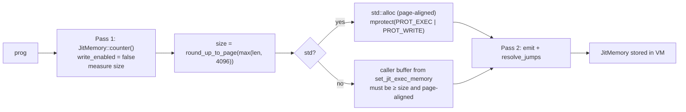

import { Callout } from 'nextra/components'

# x86_64 JIT

**Relevant source files**

- [src/jit.rs](https://github.com/volnlabs/rbpf/blob/main/src/jit.rs)
- [src/lib.rs](https://github.com/volnlabs/rbpf/blob/main/src/lib.rs)
- [tests/ubpf_jit_x86_64.rs](https://github.com/volnlabs/rbpf/blob/main/tests/ubpf_jit_x86_64.rs)
- [tests/jit_sizing.rs](https://github.com/volnlabs/rbpf/blob/main/tests/jit_sizing.rs)

The handwritten x86_64 JIT comes from uBPF's JIT algorithm. The `jit` module, `jit_compile()`, `execute_program_jit()` and `set_jit_exec_memory()` are compiled only under:

```rust
#[cfg(all(target_arch = "x86_64", not(windows)))]
```

The fork introduced this gate; the old one was `not(windows)`. It keeps AArch64 and other architectures from building or running the x86 emitter.

## Generated function signature

```rust
type MachineCode = unsafe fn(*mut u8, usize, *mut u8, usize, usize, usize) -> u64;
//                           mbuff,   mbuff_len, mem, mem_len, mem_offset, mem_end_offset
```

The VM wrappers call it as follows:

| Wrapper | `use_mbuff` | `update_data_ptr` | Arguments |
|---|---|---|---|
| `EbpfVmMbuff` | true | false | caller's `mbuff`, `mem`, `0, 0` |
| `EbpfVmFixedMbuff` | true | true | internal buffer, `mem`, `data_offset`, `data_end_offset`. The prologue writes `mem`/`mem_end` into the buffer. |
| `EbpfVmRaw` / `EbpfVmNoData` | false | false | empty `mbuff`, `mem` |

An empty `mem` is passed as a null pointer, which matches uBPF.

## Register mapping

| eBPF | x86_64 | Role |
|---|---|---|
| r0 | RAX | return value |
| r1 | RDI | arg 1 |
| r2 | RSI | arg 2 |
| r3 | RDX | arg 3 |
| r4 | R9 | arg 4 |
| r5 | R8 | arg 5 |
| r6–r9 | RBX, R13, R14, R15 | callee-saved |
| r10 | RBP | BPF frame pointer |

R10 holds the `mem` pointer for `LD_ABS`/`LD_IND`. R11 and RCX are scratch, and RCX is also used for shifts and division.

## Compilation pipeline



`JitMemory::new` compiles twice. The first pass is a dry run: it counts bytes and writes nothing, and the result sets the buffer size. The second pass emits the code and patches relative jumps (`resolve_jumps`). `tests/jit_sizing.rs` checks that a dry run still resolves jumps correctly.

<Callout type="warning">
With `std`, the executable buffer is mapped **writable and executable at the same time** (`PROT_EXEC | PROT_WRITE`) and stays that way. The generated code also performs **no memory-bounds checks**. Use the JIT only with trusted, already validated programs.
</Callout>

### `no_std` executable memory

```rust
let mut vm = rbpf::EbpfVmRaw::new(Some(prog)).unwrap();
// `exec` must be page-aligned (4096), large enough for the page-rounded code,
// and already mapped executable by the caller.
vm.set_jit_exec_memory(exec)?;
vm.jit_compile()?; // consumes the buffer (Option::take)
```

`jit_compile()` returns an error when no buffer was set, when it is too small ("Executable memory is too small"), or when it is misaligned ("Executable memory is not aligned"). The buffer is taken by the compile call, so call `set_jit_exec_memory` again before every recompilation.

## Semantics notes

- **Helpers**: `CALL src=0` emits a direct call to the helper's address, so the helper must be registered before `jit_compile()`. You can replace a helper afterwards only by recompiling. If the ID is not registered at compile time, compilation fails with "[JIT] Error: unknown helper function".
- **Local calls**: `CALL src=1` is supported through `emit_local_call`.
- **Tail calls**: `TAIL_CALL` hits `unimplemented!()` (panic).
- **Division**: division by zero gives 0. Modulo by zero leaves `dst` unchanged.
- **Stack**: `STACK_SIZE` (512) bytes are reserved below RBP on the native stack.

## Conformance status

CI runs the `bpf_conformance` suite against the JIT through `examples/rbpf_plugin.rs --jit`, but the step is **non-blocking** (`continue-on-error`) because of [upstream issue #60](https://github.com/qmonnet/rbpf/issues/60). The interpreter and Cranelift conformance steps are blocking. See [Testing and CI](/rbpf/testing).
